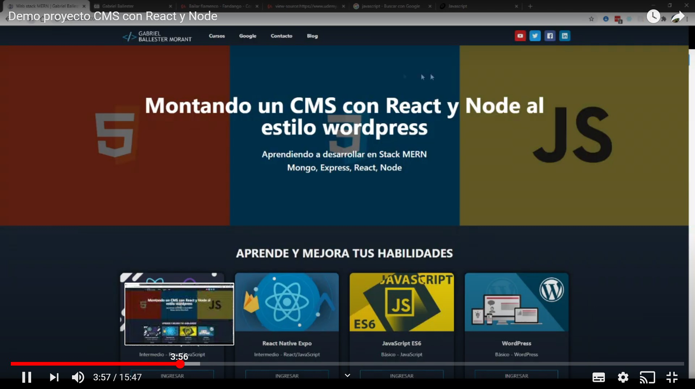
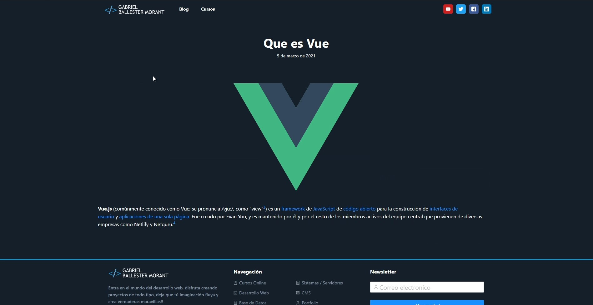
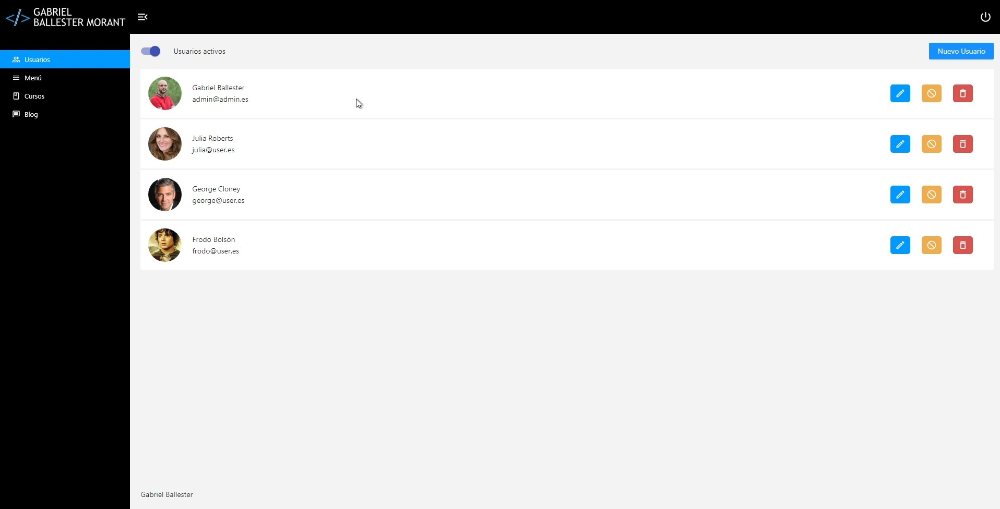
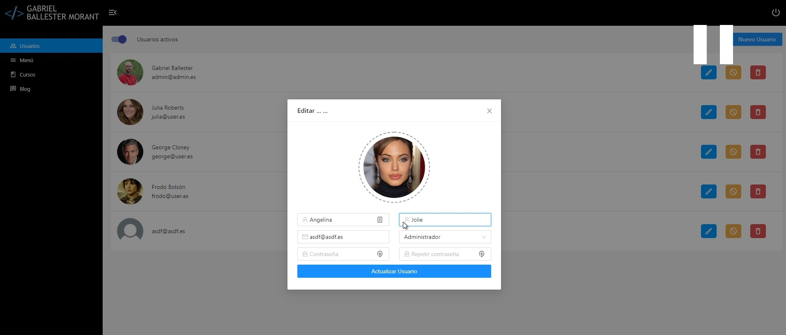
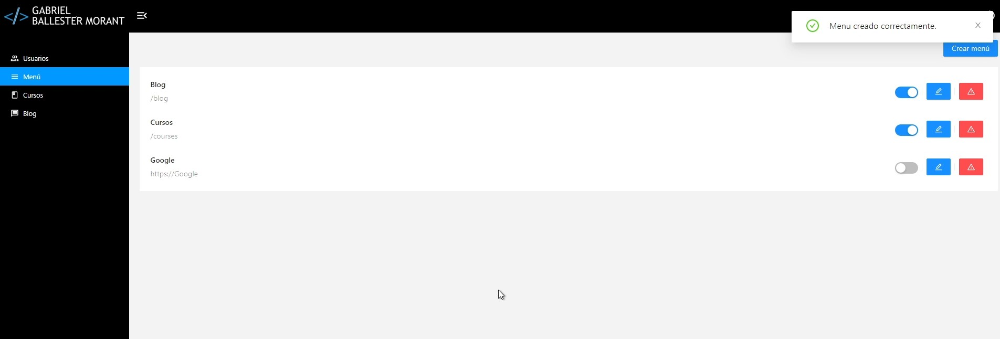
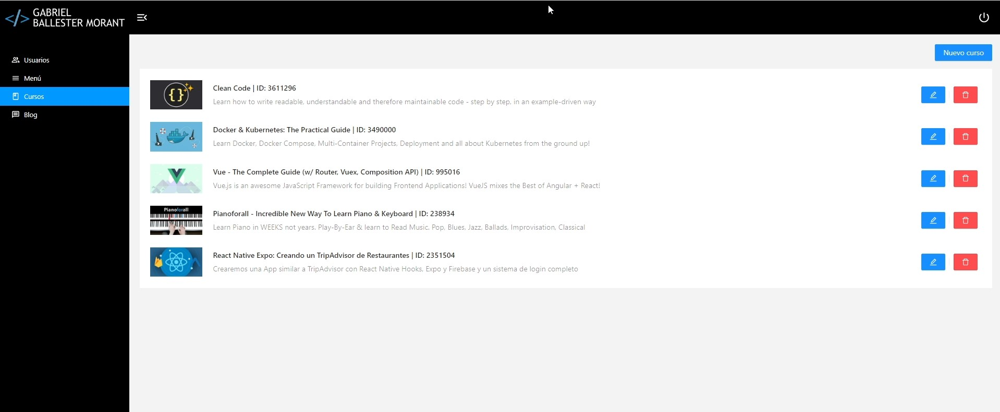
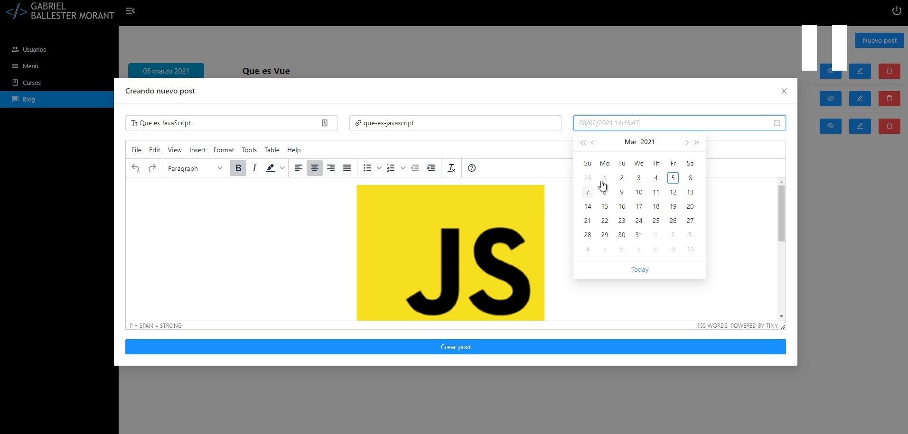

### Proyecto CMS similar a Wordpress, creado con React + Node

- Este repositorio es sólo el frontend de este proyecto.
- El repo del backend lo encontrarás aquí:  
[https://github.com/gabyballester/back-api-cms-tipo-wordpress-react-node](https://github.com/gabyballester/back-api-cms-tipo-wordpress-react-node)

***
#### 1. Instalar dependencias
`yarn install`
#### 2. Arrancar proyecto
`yarn dev`
#### 3. Cambiar modo api de local a Heroku
En el archivo  `src/api/config.js` podemos elegir entre:
- export const basePath = "https://web-personal-stack-mern.herokuapp.com/api";
- export const basePath = "http://localhost:3977/api";
#### 4. Uso de datos
- Api de Udemy
- Backend de Node que alimenta el resto de datos
#### 5. Video demo del proyecto

#### 6. Capturas del proyecto

